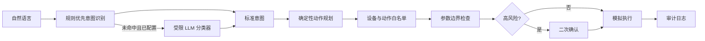

# HomeSignal — 基于自然语言意图识别的智能家居 LLM 控制系统

[](https://github.com/RenaissanceAIOT/smart-home-llm-control-system/actions/workflows/ci.yml)
[](https://www.python.org/)
[](https://streamlit.io/)
[](data/README.md)

一个安全优先、可解释、可复现的中文智能家居自然语言控制原型。系统把开放式语言理解与确定性设备控制彻底分开：**LLM 最多只能返回标准意图，设备选择、动作生成、参数边界和高风险确认全部由规则引擎掌控。**

> 当前版本是软件仿真 Demo，不连接真实家庭设备。仓库内 1,119 条数据是可复现的合成覆盖集，不是报告中缺失的原始用户记录。

## 为什么做这个项目

传统关键词系统能处理“打开客厅灯”，却很难理解“我好冷”“我要洗澡”“屋里太闷”。纯 LLM 能理解生活化表达，但如果让它直接生成设备 JSON，就可能产生不存在的设备、非法动作或越界参数。

HomeSignal 采用分层混合架构：



LLM 不知道真实设备 ID，也无权生成自由动作。这条边界让语言理解保持灵活，让执行链路保持可审计。

## 现在可以做什么

- 理解显式控制：`把客厅灯亮度调到 50%`
- 理解隐含意图：`今天好热，我要去卧室休息一会`
- 触发组合场景：`我要洗澡了`、`准备睡觉了`
- 拦截危险操作：`打开门锁` 必须二次确认
- 拒绝越界参数：空调 16-30°C、热水器 35-55°C、百分比 0-100
- 检测设备和动作幻觉：不在白名单或能力集合中的命令无法执行
- 保存简单自动化：`每天早上 6 点起床，自动打开卧室窗帘`
- 在无 API Key 情况下完整运行本地规则链路
- 可选连接 OpenAI-compatible Chat Completions 接口，仅用于未知表达的意图分类

## 快速开始

### 本地运行

```bash
git clone https://github.com/RenaissanceAIOT/smart-home-llm-control-system.git
cd smart-home-llm-control-system

python -m venv .venv
source .venv/bin/activate        # Windows: .venv\Scripts\activate
python -m pip install -e ".[dev]"

streamlit run app.py
```

浏览器打开 `http://localhost:8501`。

### 一条命令验证

```bash
smart-home-demo "今天好热，我要去卧室休息一会"
smart-home-demo "打开门锁"
smart-home-demo --confirm "打开门锁"
```

### Docker

```bash
docker compose up --build
```

运行数据持久化到 `runtime/`，该目录默认不会提交到 Git。

## 可选 LLM 配置

本地规则模式不需要任何密钥。若要测试未知表达的受限意图分类：

```bash
cp .env.example .env
# 填写 LLM_API_KEY；也可设置 LLM_MODEL 与 LLM_BASE_URL
streamlit run app.py
```

LLM 响应必须是 `{"intent":"known_label"}`。未知标签、超时、网络错误或无效 JSON 都会进入保守失败路径，不生成任何动作。

## 设备与安全规则

当前逻辑目录包含 47 台模拟设备，覆盖 8 类家庭设备：照明、厨卫、空调、门窗、窗帘、家电、影音和安防。

| 安全层 | 示例 | 系统行为 |
| --- | --- | --- |
| 设备白名单 | `appliance.time_machine` | 拒绝并记录 `UNKNOWN_DEVICE` |
| 动作能力 | 让灯执行 `unlock` | 拒绝并记录 `UNSUPPORTED_ACTION` |
| 参数边界 | 空调设置 35°C | 拒绝并记录 `PARAMETER_OUT_OF_RANGE` |
| 高风险确认 | 解锁智能门锁 | 计划可见，但确认前不执行 |
| 健康语境 | “我感冒发冷” | 提醒设备动作不替代医疗判断并要求确认 |
| 模型失败 | API 超时或返回未知标签 | fail closed，不生成命令 |

完整边界见 [安全模型](docs/safety-model.md)，分层与扩展点见 [架构文档](docs/architecture.md)。

## 数据集

仓库提交了 `data/smart_home_commands_synthetic.csv`：

| 指令类型 | 样本数 | 子类型 |
| --- | ---: | --- |
| 显式指令 | 526 | 开关 412、参数 114 |
| 隐式指令 | 593 | 体感 287、场景 236、健康 70 |
| 合计 | 1,119 | 8 个设备类别 |

它由固定种子和已提交模板生成，所有行都包含：原始语句、指令类型、标准意图、房间、主设备、类别、标准命令 JSON、数据划分和隐私标记。

```bash
python scripts/generate_dataset.py
python scripts/validate_dataset.py
python scripts/evaluate.py --output artifacts/evaluation-local.json
```

重要限制：这是用于接口、规则和回归测试的**合成覆盖集**，语言多样性有限，标签与实现共享同一意图词表，因此本地评测只代表覆盖检查，不能代表真实家庭准确率。详见 [Dataset Card](docs/dataset-card.md)。

## 实验结果如何理解

项目 PDF 记录了以下历史实验数值：

| 架构 | 显式指令准确率 | 隐式指令准确率 | 全局控制成功率 | 全局幻觉率 |
| --- | ---: | ---: | ---: | ---: |
| 纯规则 | 98.12% | 63.71% | 79.89% | 0.50% |
| 原生 LLM | 91.25% | 83.26% | 87.40% | 10.72% |
| LLM + 规则混合 | 97.89% | 92.57% | 95.17% | 1.16% |

这些数值来自报告中的项目实验记录；由于原始样本、逐条预测、模型版本和运行日志没有随报告公开，**本仓库不会把它们冒充为当前代码的已复现实验结果**。`scripts/evaluate.py` 会把自己的输出标为 `synthetic_coverage_check`，避免混淆。

## 项目结构

```text
.
├── app.py                         # Streamlit 安全控制台
├── src/smart_home_control/
│   ├── intents.py                 # 规则优先 + 可选受限 LLM
│   ├── planner.py                 # 意图到固定命令的映射
│   ├── safety.py                  # 白名单、能力、参数与确认联锁
│   ├── executor.py                # 内存模拟执行器
│   ├── automation.py              # SQLite 定时记忆
│   ├── audit.py                   # JSONL 审计日志
│   └── catalog.py                 # 47 台逻辑设备目录
├── data/                          # 合成数据、摘要、Schema、数据说明
├── scripts/                       # 生成、校验与覆盖评测
├── tests/                         # 核心链路与安全回归测试
├── docs/                          # 架构、安全模型与 Dataset Card
├── DESIGN.md                      # 可复用的视觉设计系统
├── PRODUCT.md                     # 产品边界与研究定位
├── .github/                       # CI、Issue 与 PR 模板
├── Dockerfile
└── compose.yaml
```

## 开发与验证

```bash
make install
make check
```

`make check` 会依次运行 Ruff、Pytest、数据集再生成/校验和本地覆盖评测。CI 在 Python 3.10、3.11、3.12 上执行相同核心检查。

## 真实设备接入路线

推荐先接入低风险设备并保持现有逻辑 ID：

1. 实现 Home Assistant 或 MQTT executor，把逻辑 ID 映射到真实 entity/topic。
2. 增加身份认证、家庭角色权限、请求签名和重放保护。
3. 要求设备回执，补充超时、幂等、补偿与断网恢复。
4. 对门锁、阀门、加热器等设备使用独立的物理安全策略。
5. 在获得住户明确同意后采集脱敏数据，并记录模型、提示词、规则版本和逐条预测。

## 贡献与安全

请先阅读 [CONTRIBUTING.md](CONTRIBUTING.md) 和 [SECURITY.md](SECURITY.md)。不要提交密钥、地址、录音、摄像头数据、网络拓扑或真实家庭日志。

## 项目材料

- [原始项目报告 PDF](基于自然语言意图识别的智能家居LLM控制系统.pdf)
- [架构设计](docs/architecture.md)
- [安全模型](docs/safety-model.md)
- [数据集说明](docs/dataset-card.md)
- [产品定义](PRODUCT.md)
- [视觉设计系统](DESIGN.md)

---

**English:** HomeSignal is a safety-first Chinese smart-home control prototype. The optional LLM is constrained to intent classification; deterministic code owns device selection, parameter validation, confirmation policy, and simulated execution. The committed 1,119-row dataset is synthetic and reproducible, not private household telemetry.
