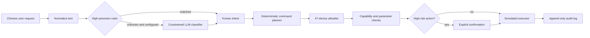

# Architecture

The system applies one hard boundary: probabilistic language understanding may propose a **known intent label**, but it may not choose a device, action, or parameter.

## Trust boundaries

| Boundary | Input | Output | Failure behavior |
| --- | --- | --- | --- |
| Rule classifier | Free text | Known intent | Returns `unknown` |
| Optional LLM | Free text | One enum label | Invalid/error becomes `unknown` |
| Planner | Known intent | Allowlisted logical commands | Unknown intent yields no commands |
| Safety interlock | Commands | Findings and risk | Errors reject; high risk waits |
| Executor | Validated commands | Simulated state | Never receives unvalidated plans |

## Adding a real integration

Implement a new executor behind the same `execute(Command)` interface. Keep provider entity IDs outside model-visible prompts, map logical IDs to integration IDs in configuration, require device acknowledgements, and preserve idempotency plus audit logging. Start with low-risk lights or sockets; do not use the prototype confirmation flow as production-grade authentication.

